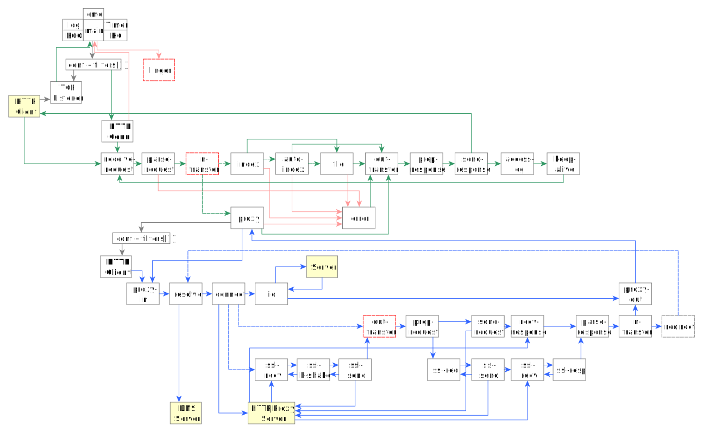

# Architecture

## HTTP/1.1 server/client



The main point is that HTTP server/client implementation is easy to use from other projects.  It has a very flexible configuration: the parent code can add/substitute any filter in chain (as long as HTTP session logic is correct, of course).

## Full-duplex

```C
	[WW]
	   Req-Channel            Resp-Channel
	Browser     Server      Server      Browser
	===========================================
	* ----->    ...
	                        * --------> ...
	(waiting for Server,    waiting for Browser)
	@ <-------- * [=>RW]    @ <-------- * [=>WR]


	[RW]
	   Req-Channel            Resp-Channel
	Browser     Server      Server      Browser
	===========================================
	... <------ *
	                        * --------> ...
	(need data from Browser,waiting for Browser)
	* --------> @ [=>WW]    @ <-------- * [=>RR]


	[RR]
	   Req-Channel            Resp-Channel
	Browser     Server      Server      Browser
	===========================================
	                        ... <------ *
	... <------ *
	(need data from Browser,need data from Server)
	* --------> @ [=>WR]    * --------> @ [=>RW]


	[WR]
	   Req-Channel            Resp-Channel
	Browser     Server      Server      Browser
	===========================================
	                        ... <------ *
	* ----->    ...
	(waiting for Server,    need data from Server)
	@ <-------- * [=>RR]    * --------> @ [=>WW]
```
