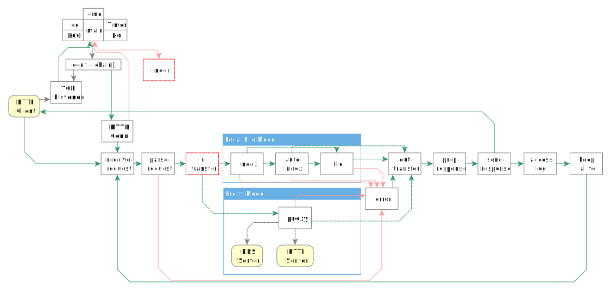
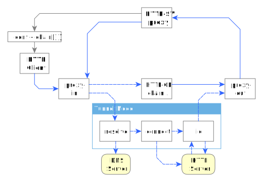
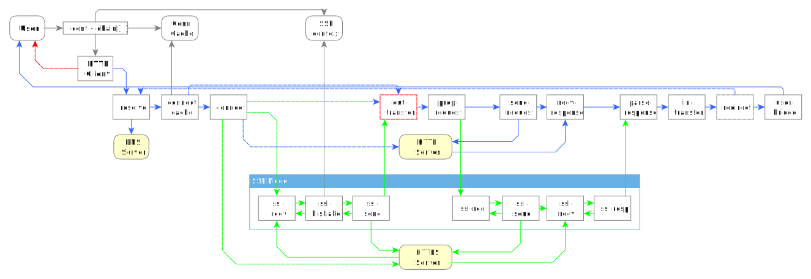
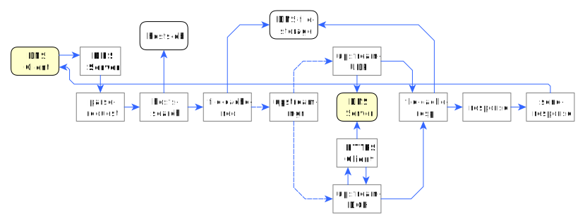

# netmill Architecture

## HTTP/1.1 server/client

The main point here is that HTTP server/client implementation is easy to use from other projects.
It has a very flexible configuration: the parent code can add/substitute any component in the conveyor chain (as long as HTTP session logic is correct, of course).

By default, the server can act as a file server or a proxy:



Proxy-Server component uses HTTP-Client chain internally for accessing the upstream server:



HTTP Client can operate in Plain or SSL modes:



### Full-duplex I/O

```C
	[WW]
	   Req-Channel            Resp-Channel
	Browser     Server      Server      Browser
	===========================================
	* ----->    ...
	                        * --------> ...
	(waiting for Server,    waiting for Browser)
	@ <-------- * [=>RW]    @ <-------- * [=>WR]


	[RW]
	   Req-Channel            Resp-Channel
	Browser     Server      Server      Browser
	===========================================
	... <------ *
	                        * --------> ...
	(need data from Browser,waiting for Browser)
	* --------> @ [=>WW]    @ <-------- * [=>RR]


	[RR]
	   Req-Channel            Resp-Channel
	Browser     Server      Server      Browser
	===========================================
	                        ... <------ *
	... <------ *
	(need data from Browser,need data from Server)
	* --------> @ [=>WR]    * --------> @ [=>RW]


	[WR]
	   Req-Channel            Resp-Channel
	Browser     Server      Server      Browser
	===========================================
	                        ... <------ *
	* ----->    ...
	(waiting for Server,    need data from Server)
	@ <-------- * [=>RR]    * --------> @ [=>WW]
```

### SSL

```C
// Receiving:
	"ssl-recv"
	(!SSL_RECV)
			>>
				"ssl-IO"
				(!SSL_IN_DATA)
				ffssl_conn_IO(): FFSSL_WANTREAD
				SSL_RECV=ffssl_conn_iobuf()
			<<
	"ssl-recv"
	(SSL_RECV)
	SSL_RECV=0
	SSL_IN_DATA=recv()
			>>
				"ssl-IO"
				(SSL_IN_DATA)
				ffssl_conn_input()
// Sending:
				"ssl-IO"
				ffssl_conn_IO(): FFSSL_WANTWRITE
				SSL_OUT_DATA=ffssl_conn_iobuf()
						>>
							"ssl-send"
							(SSL_OUT_DATA)
							SSL_SENT=send()
						<<
				"ssl-IO"
				(SSL_SENT)
				SSL_SENT=0
				ffssl_conn_input()
// Completion:
				ffssl_conn_IO(): OK
						>>
							"ssl-send"
							(!SSL_OUT_DATA)
									>>
										"..."
```


## DNS


